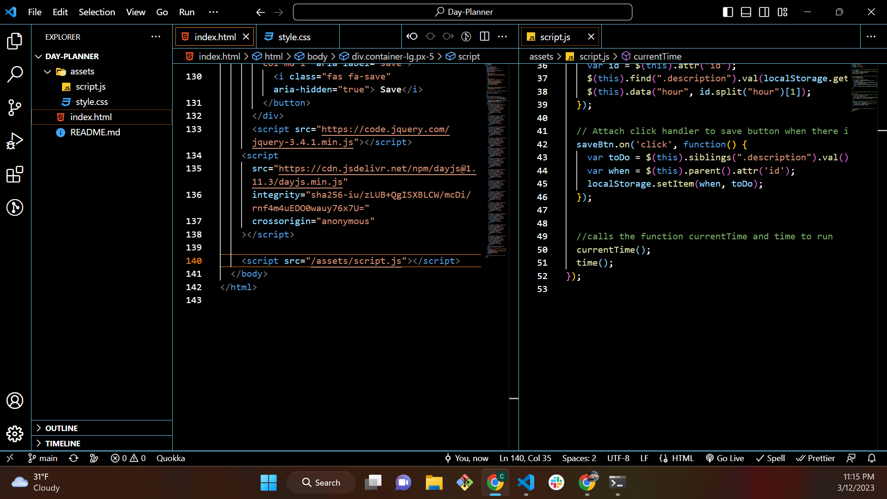
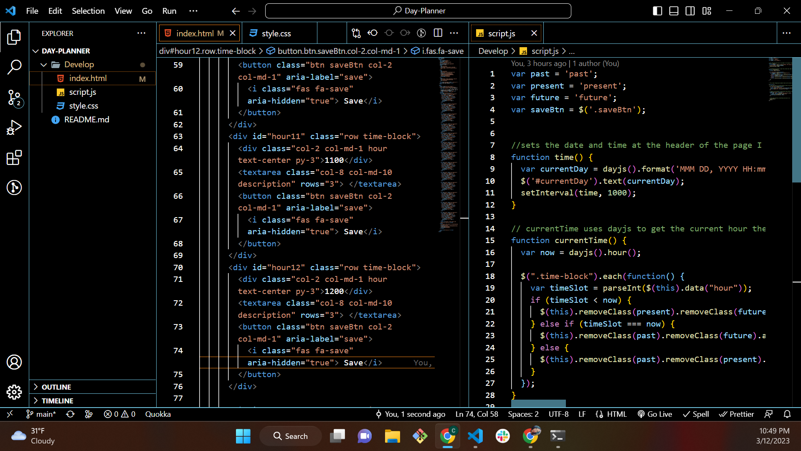
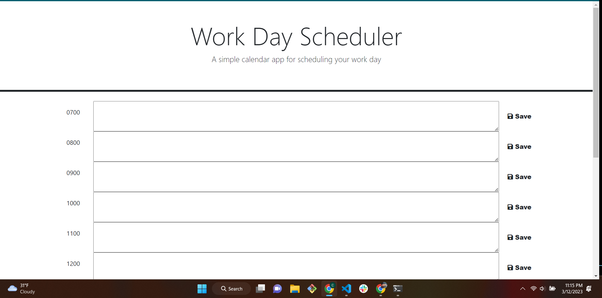
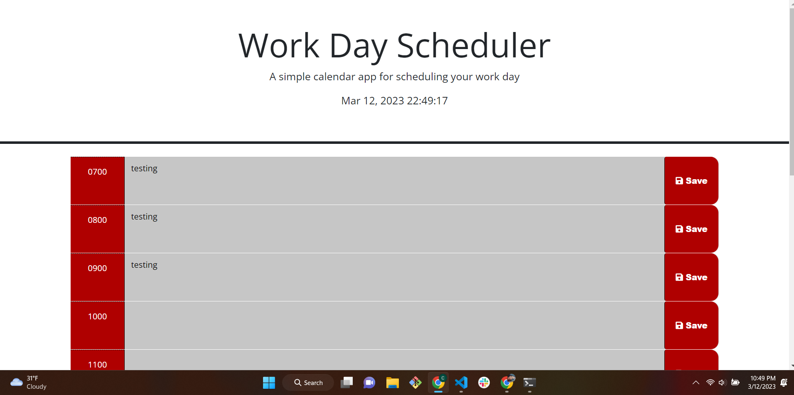

# Daily Planner

## My Launched Planner
 A link to my launched planner 
[Here](https://smiliekay.github.io/Daily-Planner/)
 
 ## My Goal
 I wanted to make a daily planner using my newly learned skills of HTML,CSS,JavaScript,Bootstrap and JQuery. I also used Day js to add the time at the top of the planner and for the tabs of the timer to be able to change colors according to if it for the past, present,or future. 

## User/Creator Story
I have a long work history in the medical field doing 12 hour shifts and using 24 hour (military) time. I was aiming to design a planner that would be useful in such an environment. That is why I added a 24 hour clock at the top and kept with military time on the tabs.  I had originally made it as a 8 hour planner with a 8 hour day in mind, however after looking at my page long and hard I know from experience that there are very few planners available for those that work 12 hour shifts and I wanted to fill a need for that. I also wanted to fill a need for a 24 hour planner since those that work in the medical field work day and night. I wanted it to be useful for those on day shift as well as night shift.  I also wanted to make it very user friendly so I changed the color layout some. I went with a brighter color for the time and save backgrounds to make them easy to see and went with yellow for future so it is easy to spot and green for the present, or green for go. I also added "save" to the tab so it was easy to identify and remember to save your task. 

## Some pictures of my work

It took quite a lot of trial and error and writing code that was not very nice looking to start with but in the end I was able to make something I am proud of. 

When I first launched my site with gitHub it did not go as well as I hoped it launched my read me and then it did not connect the JavaScript or css. It took a few tries to get it right but it is up and working correctly now

This was quite a challenge but I enjoy a good challenging puzzle. 